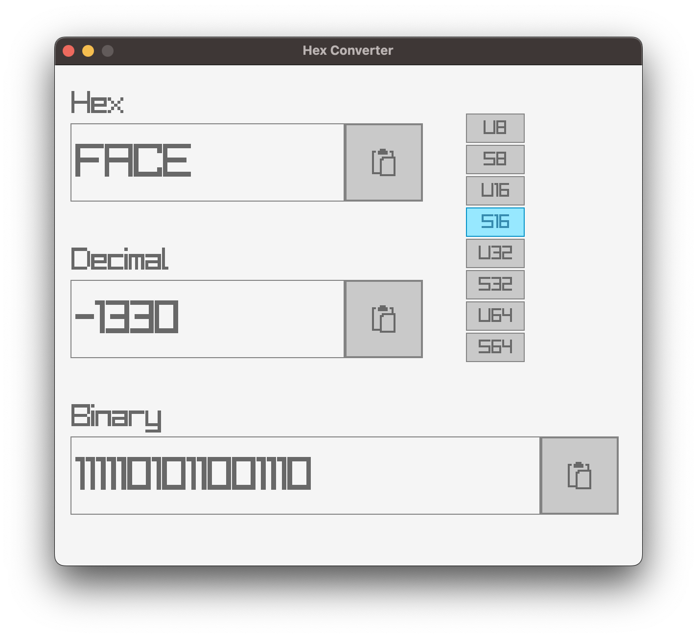

# Hex Converter

A simple app for converting between hex and decimal written in C++/raylib/raygui.

I built this app to assist with developing the NES emulator that I'm working on. I end up often debugging memory addresses and since I'm bad at converting these on the fly, this saves me a bunch of time. Maybe you'll find it useful as well.

## How to Build

The easiest way is to clone the repo and run `./build.sh && ./run.sh`. This is verified to work on Mac and Windows under a bash shell such as MINGW. You can also open this project in VSCode and if you have the CMake extension installed, it will likely prompt you to select a kit, and you can build/debug using VSCode as your IDE. I've tested this flow on Mac and Windows, using Clang 14.x on Mac and VS Community 2022 on Windows, and both seem to build and run just fine.
